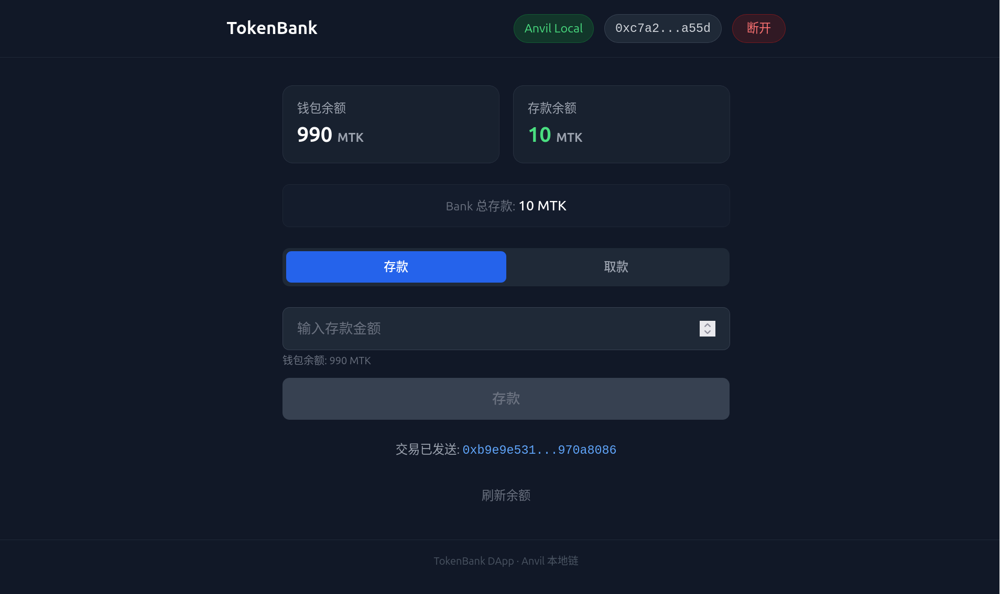

<div align="center">
  <h1>TokenBank DApp</h1>
  <p>基于 Viem 构建的 TokenBank 存款/取款前端</p>
  
</div>

---

## 功能

- 连接 MetaMask / OKX 等钱包，自动切换/添加 Anvil 本地网络
- 查看 MyToken (MTK) 钱包余额、存款余额、Bank 总存款
- 授权 → 存款 → 取款完整流程，支持部分提取和**全部取出**
- 交易哈希可点击跳转 Etherscan，余额自动刷新

## 技术栈

| 技术 | 说明 |
|------|------|
| Vite + React 18 | 前端框架 |
| Viem v2 | 以太坊合约读写 |
| Tailwind CSS | 样式 |
| Foundry (Anvil) | 本地开发链 |

## 合约

| 合约 | 地址 |
|------|------|
| MyToken (MTK) | `0x5FbDB2315678afecb367f032d93F642f64180aa3` |
| TokenBank | `0xe7f1725E7734CE288F8367e1Bb143E90bb3F0512` |

合约源码位于 `../MyToken/`（Foundry 项目）。

可通过 `.env` 自定义：

```env
VITE_TOKEN_BANK_ADDRESS=0x...
VITE_TOKEN_ADDRESS=0x...
VITE_RPC_URL=http://localhost:8545
```

## 本地运行

```bash
# 1. 启动本地区块链
anvil --host 0.0.0.0 --port 8545

# 2. 部署合约
cd ../MyToken
PRIVATE_KEY=0xac0974bec39a17e36ba4a6b4d238ff944bacb478cbed5efcae784d7bf4f2ff80 \
  forge script script/DeployBank.s.sol --rpc-url http://localhost:8545 --broadcast

# 3. 启动前端
cd ../front-page
npm install
npm run dev
```

访问 **http://localhost:5173**，连接钱包即可使用。

## 操作流程

**存款**: 连接钱包 → 切换 Anvil 网络 → 输入金额 → 授权 → 存款

**取款**: 切换到「取款」标签 → 输入金额 → 取款（或点击「全部取出」）